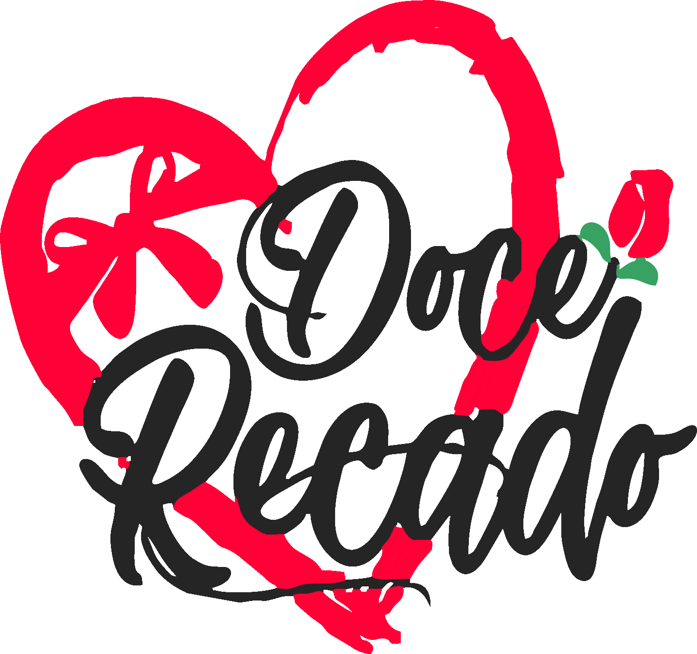

<h1 align="center">
 
  
 
Doce Recado Floricultura | Site Responsivo 🎍
</h1>

[english]
 
Institutional website of a real case. The site's proposal is to solve all the doubts that the client may have and, above all, to convey confidence and professionalism.
The project was developed using the Mobile First methodology, thus being compatible with all mobile devices and with a beautiful and pleasant user interface.
The site has Dark and Light mode themes and scrolling animations
 
 
[português]
 
Site institucional de um caso real. A proposta do site é sanar todas as dúvidas que o cliente possa ter e acima de tudo passar confiança e profissionalismo. 
O projeto foi desenvolvido utilizando a metodologia Mobile First, sendo assim compátivel com todos dispositivos móveis e com uma interface de usuário bonita e agrádavel.
O site possui temas Dark e Light mode e animações de scrolling

## 🎍: [Clique aqui para acessar o projeto](https://1strodrigo.github.io/doce-recado-floricultura/)

  
  

---

# Arquivos

### - [HTML](https://github.com/1stRodrigo/doce-recado-floricultura/blob/main/index.html)

### - [JS](https://github.com/1stRodrigo/doce-recado-floricultura/tree/main/assets/js)

### - [CSS](https://github.com/1stRodrigo/doce-recado-floricultura/tree/main/assets/css)

### - [SCSS](https://github.com/1stRodrigo/doce-recado-floricultura/tree/main/assets/scss)

### - [IMG](https://github.com/1stRodrigo/doce-recado-floricultura/tree/main/assets/img)

---

## 🚀 Technologies

This project was developed with the following technologies:

- ✔️ JavaScript - Animações, troca de temas, preferências do usuário

- ✔️ HTML - Marcação de texto

- ✔️ CSS / SCSS - Estilização

- ✔️ Mobile First (Methodology) - Usado para responsivo mobile e desktop

---

Made by Rodrigo Oliveira.
-> [Veja o meu linkedin](https://www.linkedin.com/in/rodrigo-oliveira-656270236/)
